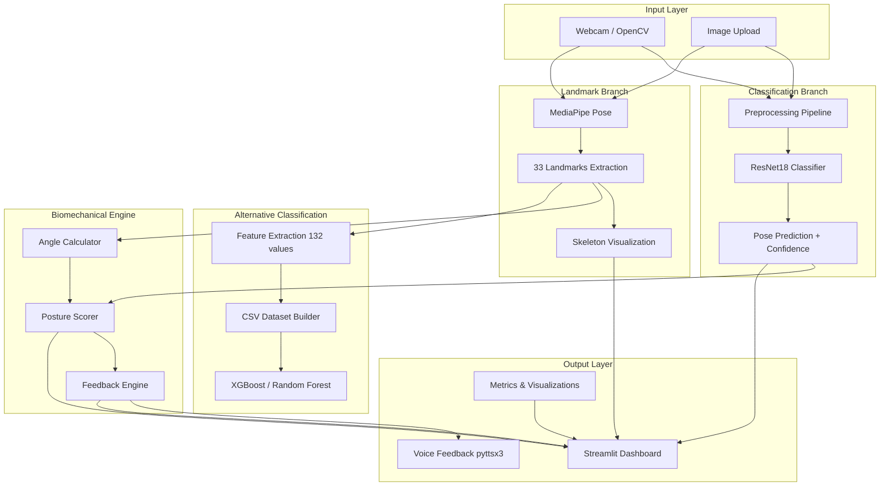
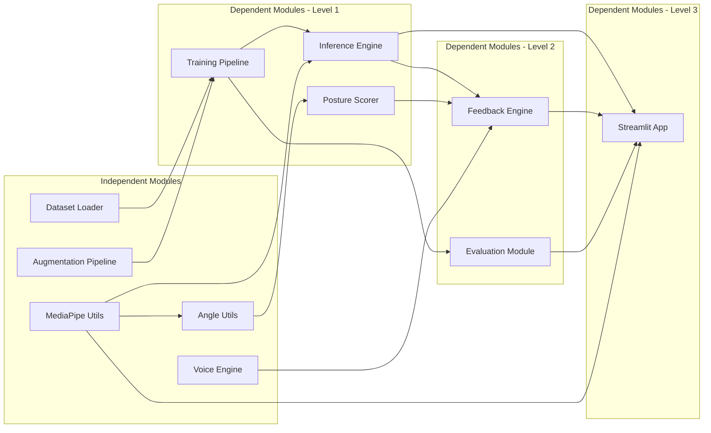
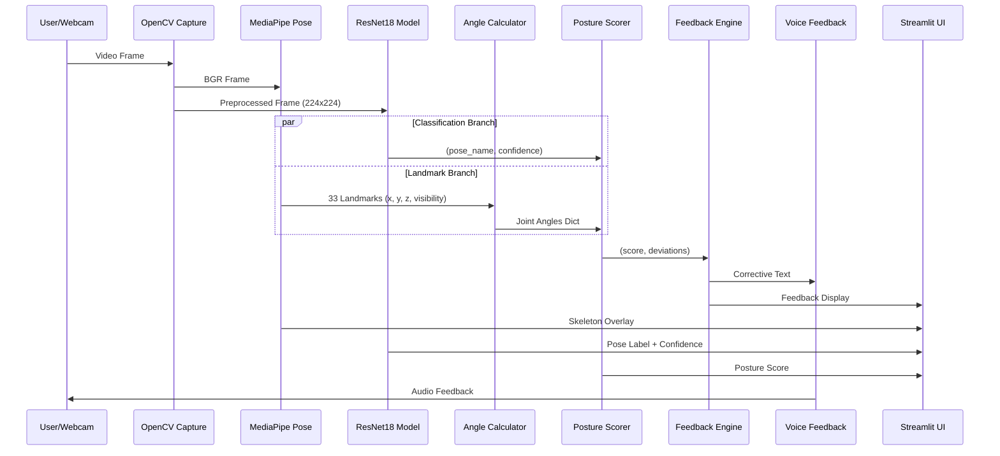
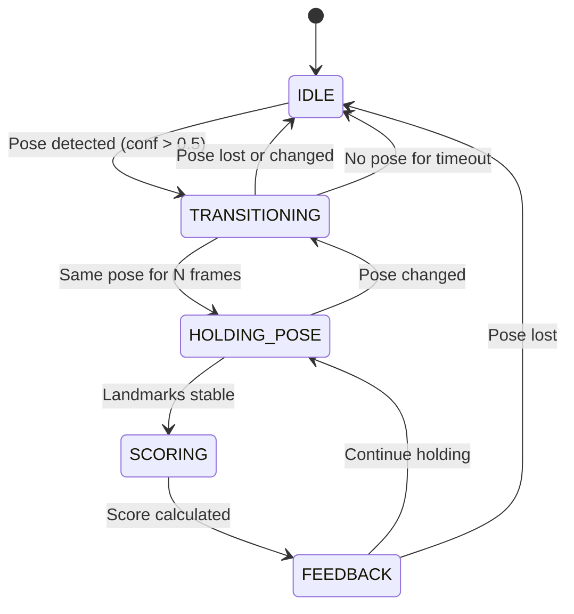
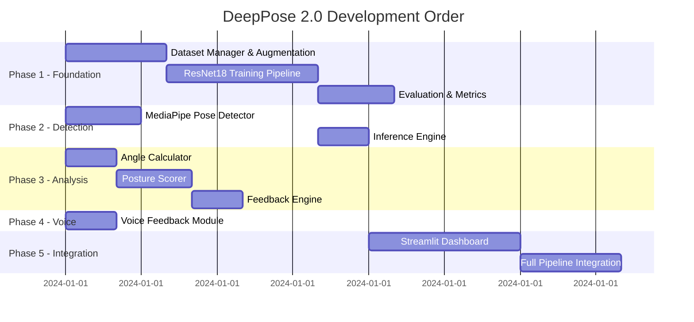

# Design Document: DeepPose 2.0 — AI-Powered Yoga Pose Recognition & Correction System

## Overview

DeepPose 2.0 is an end-to-end AI system that recognizes 11 yoga poses in real time via webcam, scores posture quality using biomechanical angle analysis, and provides corrective voice feedback. The system combines deep learning (ResNet18 transfer learning) for pose classification with MediaPipe for skeleton landmark extraction, delivering results through a Streamlit web dashboard.

The architecture follows a modular pipeline design: raw frames flow through a classification branch (ResNet18) and a landmark branch (MediaPipe) in parallel, converging at a scoring engine that fuses predictions with biomechanical analysis. An alternative tabular classification path (XGBoost/Random Forest on extracted landmarks) provides sub-1ms inference for resource-constrained environments.

The system is organized into five development phases — data preparation & training, real-time inference, biomechanical analysis, voice feedback, and dashboard integration — each designed as independent modules with clear interface boundaries to support parallel development and testing.

## Architecture

### System-Level Architecture



### Module Dependency Diagram



### Data Flow — Real-Time Pipeline



### State Machine — User Session



## Components and Interfaces

### Component 1: Dataset Manager (`models/train.py`)

**Purpose**: Handles dataset loading, automatic splitting, augmentation, and DataLoader creation.

```python
class DatasetManager:
    def __init__(self, dataset_path: str, img_size: int = 224, batch_size: int = 32):
        ...

    def load_and_split(self, test_size: float = 0.2, val_size: float = 0.1,
                       random_state: int = 42) -> Tuple[DataLoader, DataLoader, DataLoader]:
        """Stratified split into train/val/test DataLoaders."""
        ...

    def get_class_names(self) -> List[str]:
        """Returns sorted list of 11 yoga class names."""
        ...

    def get_class_weights(self) -> torch.Tensor:
        """Computes inverse-frequency class weights for imbalance handling."""
        ...
```

**Responsibilities**:
- Walk dataset directory to collect image paths and labels
- Perform stratified train/val/test split using sklearn
- Apply train-time augmentation (flip, rotation, color jitter)
- Apply eval-time transforms (resize, normalize only)
- Compute class weights for balanced training

### Component 2: Training Pipeline (`models/train.py`)

**Purpose**: Manages ResNet18 transfer learning training loop with early stopping.

```python
class YogaTrainer:
    def __init__(self, num_classes: int = 11, learning_rate: float = 0.001,
                 patience: int = 5, device: str = "cuda"):
        ...

    def build_model(self) -> nn.Module:
        """Creates ResNet18 with frozen backbone and new FC head."""
        ...

    def train(self, train_loader: DataLoader, val_loader: DataLoader,
              epochs: int = 50) -> Dict[str, List[float]]:
        """Full training loop with early stopping. Returns history dict."""
        ...

    def save_checkpoint(self, path: str = "checkpoints/best_model.pth") -> None:
        """Saves model state dict."""
        ...
```

**Responsibilities**:
- Initialize ResNet18 pretrained on ImageNet
- Freeze convolutional backbone, replace fc layer
- Train with CrossEntropyLoss (weighted) + Adam optimizer
- Track train/val loss and accuracy per epoch
- Implement early stopping on validation loss
- Save best model checkpoint

### Component 3: Inference Engine (`models/inference.py`)

**Purpose**: Loads trained model and performs single-frame or batch pose classification.

```python
class PoseInferenceEngine:
    def __init__(self, model_path: str = "checkpoints/best_model.pth",
                 class_names: List[str] = None, device: str = "cpu"):
        ...

    def predict(self, frame: np.ndarray) -> Tuple[str, float]:
        """Predict pose from BGR frame. Returns (pose_name, confidence)."""
        ...

    def predict_batch(self, frames: List[np.ndarray]) -> List[Tuple[str, float]]:
        """Batch prediction for multiple frames."""
        ...
```

**Responsibilities**:
- Load model checkpoint and set to eval mode
- Apply inference-time transforms
- Return top-1 prediction with softmax confidence
- Support both single and batch inference

### Component 4: MediaPipe Pose Detector (`mediapipe_utils/pose_detector.py`)

**Purpose**: Wraps MediaPipe Pose for landmark extraction and skeleton visualization.

```python
class PoseDetector:
    def __init__(self, static_image_mode: bool = False,
                 min_detection_confidence: float = 0.5,
                 min_tracking_confidence: float = 0.5):
        ...

    def detect(self, frame: np.ndarray) -> Optional[List[Landmark]]:
        """Extract 33 pose landmarks from BGR frame."""
        ...

    def draw_skeleton(self, frame: np.ndarray,
                      landmarks: List[Landmark]) -> np.ndarray:
        """Draw skeleton overlay on frame."""
        ...

    def extract_feature_vector(self, landmarks: List[Landmark]) -> np.ndarray:
        """Extract 132-dim feature vector (33 landmarks x 4 values)."""
        ...
```

**Responsibilities**:
- Initialize MediaPipe Pose with configurable confidence thresholds
- Extract 33 landmarks with (x, y, z, visibility) per landmark
- Draw skeleton connections on frame
- Extract flat feature vector for tabular classification

### Component 5: Angle Calculator (`scoring/angle_utils.py`)

**Purpose**: Computes joint angles from MediaPipe landmarks using vector mathematics.

```python
class AngleCalculator:
    def calculate_angle(self, point_a: np.ndarray, point_b: np.ndarray,
                        point_c: np.ndarray) -> float:
        """Calculate angle at point_b formed by vectors BA and BC."""
        ...

    def get_all_angles(self, landmarks: List[Landmark]) -> Dict[str, float]:
        """Compute all 7 joint angles from landmarks."""
        ...
```

**Responsibilities**:
- Implement 3-point angle calculation using dot product
- Extract relevant landmark triplets for each joint
- Return dictionary of named angles in degrees

### Component 6: Posture Scorer (`scoring/posture_score.py`)

**Purpose**: Scores posture quality (0-100) based on angular deviation from ideal reference angles.

```python
class PostureScorer:
    def __init__(self, ideal_angles_db: Dict[str, Dict[str, float]] = None):
        ...

    def score(self, pose_name: str, measured_angles: Dict[str, float]) -> Tuple[float, Dict[str, float]]:
        """Returns (overall_score, per_joint_deviations)."""
        ...
```

**Responsibilities**:
- Maintain ideal angle reference database per pose
- Compute per-joint deviation from ideal
- Calculate weighted overall score (0-100)
- Return both score and individual deviations for feedback

### Component 7: Feedback Engine (`scoring/feedback_engine.py`)

**Purpose**: Generates human-readable corrective instructions from score deviations.

```python
class FeedbackEngine:
    def __init__(self, deviation_threshold: float = 15.0):
        ...

    def generate_feedback(self, pose_name: str,
                          deviations: Dict[str, float]) -> List[str]:
        """Generate corrective instructions for deviations above threshold."""
        ...
```

**Responsibilities**:
- Map deviations to corrective text using rule-based lookup
- Filter feedback for deviations exceeding threshold
- Prioritize most critical corrections first
- Return list of actionable instructions

### Component 8: Voice Feedback (`voice/voice_feedback.py`)

**Purpose**: Provides non-blocking text-to-speech feedback using pyttsx3.

```python
class VoiceFeedback:
    def __init__(self, rate: int = 150):
        ...

    def speak(self, text: str) -> None:
        """Speak text in background thread (non-blocking)."""
        ...

    def stop(self) -> None:
        """Stop current speech."""
        ...
```

**Responsibilities**:
- Initialize pyttsx3 engine in background thread
- Maintain state to avoid repeating identical feedback
- Non-blocking speech via threading
- Graceful shutdown on session end

### Component 9: Streamlit Dashboard (`streamlit_app/app.py`)

**Purpose**: Multi-page web interface integrating all system components.

```python
class YogaDashboard:
    def __init__(self):
        ...

    def render_home(self) -> None: ...
    def render_image_upload(self) -> None: ...
    def render_live_camera(self) -> None: ...
    def render_model_performance(self) -> None: ...
```

**Responsibilities**:
- Render navigation sidebar with 4 pages
- Image upload page: predict, score, show feedback
- Live camera page: real-time loop with all overlays
- Performance page: display saved metrics and plots

## Data Models

### Landmark

```python
@dataclass
class Landmark:
    x: float        # Normalized [0, 1] horizontal position
    y: float        # Normalized [0, 1] vertical position
    z: float        # Depth relative to hip midpoint
    visibility: float  # Confidence [0, 1]
```

**Validation Rules**:
- x, y must be in range [0.0, 1.0]
- visibility must be in range [0.0, 1.0]

### JointAngles

```python
@dataclass
class JointAngles:
    left_knee: float
    right_knee: float
    left_hip: float
    right_hip: float
    left_elbow: float
    right_elbow: float
    shoulder_alignment: float  # Angle between shoulder line and horizontal
```

**Validation Rules**:
- All angle values in range [0.0, 180.0] degrees
- shoulder_alignment in range [0.0, 90.0] degrees

### PostureResult

```python
@dataclass
class PostureResult:
    pose_name: str
    confidence: float
    overall_score: float
    joint_deviations: Dict[str, float]
    feedback: List[str]
    timestamp: float
```

### IdealAngleDatabase

```python
IDEAL_ANGLES: Dict[str, Dict[str, float]] = {
    "tree": {
        "left_knee": 180.0,
        "right_knee": 90.0,
        "left_hip": 180.0,
        "right_hip": 45.0,
        "left_elbow": 180.0,
        "right_elbow": 180.0,
        "shoulder_alignment": 0.0,
    },
    "warrior1": { ... },
    "warrior2": { ... },
    # ... 11 poses total
}
```

### SessionState (State Machine)

```python
class SessionState(Enum):
    IDLE = "idle"
    TRANSITIONING = "transitioning"
    HOLDING_POSE = "holding_pose"

@dataclass
class UserSession:
    state: SessionState
    current_pose: Optional[str]
    frame_buffer: deque  # Rolling window of N frames
    hold_start_time: Optional[float]
    last_feedback: Optional[str]
    consecutive_pose_count: int
```

### TrainingConfig

```python
@dataclass
class TrainingConfig:
    img_size: int = 224
    batch_size: int = 32
    learning_rate: float = 0.001
    epochs: int = 50
    patience: int = 5
    test_size: float = 0.2
    val_size: float = 0.1
    random_state: int = 42
    num_classes: int = 11
    pretrained: bool = True
    freeze_backbone: bool = True
```

## Algorithmic Pseudocode

### Main Processing Algorithm — Real-Time Inference Loop

```python
ALGORITHM real_time_inference_loop(camera_source)
INPUT: camera_source (webcam device index or video path)
OUTPUT: Continuous UI updates with pose, score, feedback

BEGIN
    model = load_model("checkpoints/best_model.pth")
    pose_detector = PoseDetector()
    angle_calc = AngleCalculator()
    scorer = PostureScorer(IDEAL_ANGLES)
    feedback_engine = FeedbackEngine(threshold=15.0)
    voice = VoiceFeedback()
    session = UserSession(state=IDLE)

    cap = cv2.VideoCapture(camera_source)

    WHILE cap.isOpened() DO
        ret, frame = cap.read()
        IF NOT ret THEN BREAK

        # Parallel branches
        pose_name, confidence = model.predict(frame)
        landmarks = pose_detector.detect(frame)

        # Update state machine
        session = update_session_state(session, pose_name, confidence)

        IF landmarks IS NOT None AND session.state == HOLDING_POSE THEN
            angles = angle_calc.get_all_angles(landmarks)
            score, deviations = scorer.score(pose_name, angles)
            feedback_list = feedback_engine.generate_feedback(pose_name, deviations)

            # Non-blocking voice (only if feedback changed)
            IF feedback_list != session.last_feedback THEN
                voice.speak(feedback_list[0])
                session.last_feedback = feedback_list
            END IF

            render_ui(frame, landmarks, pose_name, confidence, score, feedback_list)
        ELSE
            render_ui(frame, landmarks, pose_name, confidence, None, None)
        END IF
    END WHILE

    cap.release()
    voice.stop()
END
```

### Angle Calculation Algorithm

```python
ALGORITHM calculate_angle(point_a, point_b, point_c)
INPUT: Three 2D/3D points representing joint positions
OUTPUT: Angle in degrees at point_b

BEGIN
    # Vector from B to A
    vector_ba = point_a - point_b

    # Vector from B to C
    vector_bc = point_c - point_b

    # Dot product
    dot_product = np.dot(vector_ba, vector_bc)

    # Magnitudes
    magnitude_ba = np.linalg.norm(vector_ba)
    magnitude_bc = np.linalg.norm(vector_bc)

    # Cosine of angle (clamped to avoid numerical errors)
    cos_angle = dot_product / (magnitude_ba * magnitude_bc + 1e-8)
    cos_angle = np.clip(cos_angle, -1.0, 1.0)

    # Convert to degrees
    angle_degrees = np.degrees(np.arccos(cos_angle))

    RETURN angle_degrees
END
```

**Preconditions:**
- point_a, point_b, point_c are numpy arrays of shape (2,) or (3,)
- Points are not coincident (magnitude > 0)

**Postconditions:**
- Returns float in range [0.0, 180.0]
- Result is geometrically valid angle at vertex point_b

### Posture Scoring Algorithm

```python
ALGORITHM calculate_posture_score(pose_name, measured_angles, ideal_angles_db)
INPUT: pose_name (str), measured_angles (Dict[str, float]), ideal_angles_db
OUTPUT: (overall_score: float, deviations: Dict[str, float])

BEGIN
    ideal = ideal_angles_db[pose_name]
    deviations = {}
    weighted_penalty = 0.0

    # Joint weights (higher = more important for this pose)
    weights = get_joint_weights(pose_name)

    FOR each joint IN measured_angles.keys() DO
        deviation = abs(measured_angles[joint] - ideal[joint])
        deviations[joint] = deviation

        # Normalized penalty: 0 at 0 degrees, 1.0 at 45+ degrees
        normalized = min(deviation / 45.0, 1.0)
        weighted_penalty += normalized * weights[joint]
    END FOR

    # Normalize by total weight
    total_weight = sum(weights.values())
    penalty_ratio = weighted_penalty / total_weight

    # Score: 100 = perfect, 0 = worst
    overall_score = max(0.0, (1.0 - penalty_ratio) * 100.0)

    RETURN (overall_score, deviations)
END
```

**Preconditions:**
- pose_name exists in ideal_angles_db
- measured_angles contains all required joint keys
- All angle values are in [0.0, 180.0]

**Postconditions:**
- overall_score in [0.0, 100.0]
- deviations contains non-negative values for each joint
- Higher score indicates better alignment with ideal pose

**Loop Invariants:**
- weighted_penalty >= 0 at all iterations
- All processed deviations are non-negative

### State Machine Update Algorithm

```python
ALGORITHM update_session_state(session, pose_name, confidence)
INPUT: current session state, detected pose name, confidence score
OUTPUT: updated session state

BEGIN
    CONFIDENCE_THRESHOLD = 0.5
    HOLD_FRAMES_REQUIRED = 10  # ~0.33 seconds at 30fps

    IF confidence < CONFIDENCE_THRESHOLD THEN
        session.consecutive_pose_count = 0
        session.state = IDLE
        session.current_pose = None
        RETURN session
    END IF

    IF pose_name == session.current_pose THEN
        session.consecutive_pose_count += 1
    ELSE
        session.current_pose = pose_name
        session.consecutive_pose_count = 1
        session.state = TRANSITIONING
    END IF

    IF session.consecutive_pose_count >= HOLD_FRAMES_REQUIRED THEN
        session.state = HOLDING_POSE
        IF session.hold_start_time IS None THEN
            session.hold_start_time = time.time()
        END IF
    ELSE IF session.consecutive_pose_count > 0 THEN
        session.state = TRANSITIONING
    END IF

    RETURN session
END
```

**Preconditions:**
- session is a valid UserSession object
- confidence in [0.0, 1.0]
- pose_name is one of 11 valid class names or None

**Postconditions:**
- session.state is one of {IDLE, TRANSITIONING, HOLDING_POSE}
- If HOLDING_POSE, consecutive_pose_count >= HOLD_FRAMES_REQUIRED
- hold_start_time is set only once when entering HOLDING_POSE

### Training Pipeline Algorithm

```python
ALGORITHM train_resnet18(dataset_path, config)
INPUT: path to dataset directory, TrainingConfig
OUTPUT: trained model saved to disk, training history

BEGIN
    # Phase 1: Data preparation
    manager = DatasetManager(dataset_path, config.img_size, config.batch_size)
    train_loader, val_loader, test_loader = manager.load_and_split(
        test_size=config.test_size, val_size=config.val_size
    )
    class_weights = manager.get_class_weights()

    # Phase 2: Model setup
    model = resnet18(pretrained=True)
    FOR param IN model.parameters() DO
        param.requires_grad = False  # Freeze backbone
    END FOR
    model.fc = Linear(512, config.num_classes)

    criterion = CrossEntropyLoss(weight=class_weights)
    optimizer = Adam(model.fc.parameters(), lr=config.learning_rate)

    # Phase 3: Training loop
    best_val_loss = infinity
    patience_counter = 0
    history = {train_loss: [], val_loss: [], train_acc: [], val_acc: []}

    FOR epoch IN range(config.epochs) DO
        # Train
        train_loss, train_acc = train_one_epoch(model, train_loader, criterion, optimizer)

        # Validate
        val_loss, val_acc = evaluate(model, val_loader, criterion)

        history.append(train_loss, val_loss, train_acc, val_acc)

        # Early stopping check
        IF val_loss < best_val_loss THEN
            best_val_loss = val_loss
            patience_counter = 0
            save_checkpoint(model, "checkpoints/best_model.pth")
        ELSE
            patience_counter += 1
            IF patience_counter >= config.patience THEN
                PRINT "Early stopping at epoch", epoch
                BREAK
            END IF
        END IF
    END FOR

    # Phase 4: Final evaluation on test set
    model.load_state_dict(load("checkpoints/best_model.pth"))
    metrics = full_evaluation(model, test_loader, manager.get_class_names())

    RETURN history, metrics
END
```

**Preconditions:**
- dataset_path contains subdirectories for each of 11 classes
- Each class directory contains valid image files
- GPU available (falls back to CPU if not)

**Postconditions:**
- best_model.pth saved with lowest validation loss weights
- history contains per-epoch metrics for plotting
- metrics contains accuracy, precision, recall, F1, confusion matrix

## Key Functions with Formal Specifications

### Function: predict()

```python
def predict(self, frame: np.ndarray) -> Tuple[str, float]:
```

**Preconditions:**
- `frame` is a valid BGR numpy array with shape (H, W, 3)
- H > 0, W > 0
- Model is loaded and in eval mode

**Postconditions:**
- Returns (pose_name, confidence) where pose_name is one of 11 classes
- confidence in [0.0, 1.0], represents softmax probability
- No side effects on input frame
- Inference time < 50ms on CPU for single frame

### Function: get_all_angles()

```python
def get_all_angles(self, landmarks: List[Landmark]) -> Dict[str, float]:
```

**Preconditions:**
- `landmarks` has exactly 33 elements (MediaPipe pose landmarks)
- All landmark visibility values > 0.3 for computed joints

**Postconditions:**
- Returns dict with keys: left_knee, right_knee, left_hip, right_hip, left_elbow, right_elbow, shoulder_alignment
- All values in [0.0, 180.0] degrees
- Computation time < 1ms

### Function: score()

```python
def score(self, pose_name: str, measured_angles: Dict[str, float]) -> Tuple[float, Dict[str, float]]:
```

**Preconditions:**
- `pose_name` is one of the 11 recognized yoga poses
- `measured_angles` contains all 7 required joint angle keys
- All angle values are non-negative

**Postconditions:**
- Returns (overall_score, deviations)
- overall_score in [0.0, 100.0]
- deviations contains non-negative float for each joint
- Pure function: no side effects

### Function: generate_feedback()

```python
def generate_feedback(self, pose_name: str, deviations: Dict[str, float]) -> List[str]:
```

**Preconditions:**
- `pose_name` is a valid pose name
- `deviations` contains per-joint deviation values >= 0.0

**Postconditions:**
- Returns list of human-readable corrective strings
- List is ordered by severity (largest deviation first)
- Empty list if all deviations below threshold
- Each string is a complete, actionable instruction

### Function: speak()

```python
def speak(self, text: str) -> None:
```

**Preconditions:**
- `text` is a non-empty string
- pyttsx3 engine is initialized

**Postconditions:**
- Speech is queued in background thread (non-blocking)
- Returns immediately without waiting for speech to complete
- Does not speak if `text` equals last spoken text (deduplication)

## Example Usage

```python
# Example 1: Training pipeline
from models.train import DatasetManager, YogaTrainer

manager = DatasetManager("dataset/", img_size=224, batch_size=32)
train_loader, val_loader, test_loader = manager.load_and_split()

trainer = YogaTrainer(num_classes=11, patience=5)
history = trainer.train(train_loader, val_loader, epochs=50)
trainer.save_checkpoint("checkpoints/best_model.pth")

# Example 2: Real-time inference with scoring
from models.inference import PoseInferenceEngine
from mediapipe_utils.pose_detector import PoseDetector
from scoring.angle_utils import AngleCalculator
from scoring.posture_score import PostureScorer

engine = PoseInferenceEngine("checkpoints/best_model.pth")
detector = PoseDetector()
calc = AngleCalculator()
scorer = PostureScorer()

frame = cv2.imread("test_warrior2.jpg")
pose_name, confidence = engine.predict(frame)
landmarks = detector.detect(frame)

if landmarks:
    angles = calc.get_all_angles(landmarks)
    score, deviations = scorer.score(pose_name, angles)
    print(f"Pose: {pose_name} ({confidence:.1%}), Score: {score:.0f}/100")

# Example 3: Feedback generation with voice
from scoring.feedback_engine import FeedbackEngine
from voice.voice_feedback import VoiceFeedback

feedback_engine = FeedbackEngine(deviation_threshold=15.0)
voice = VoiceFeedback(rate=150)

feedback = feedback_engine.generate_feedback("warrior2", deviations)
if feedback:
    voice.speak(feedback[0])  # Non-blocking

# Example 4: Alternative tabular classification
landmarks = detector.detect(frame)
features = detector.extract_feature_vector(landmarks)  # 132-dim vector
# Feed to pre-trained XGBoost model for sub-1ms inference
```

## Correctness Properties

*A property is a characteristic or behavior that should hold true across all valid executions of a system — essentially, a formal statement about what the system should do. Properties serve as the bridge between human-readable specifications and machine-verifiable correctness guarantees.*

### Property 1: Classification Completeness

*For any* valid BGR input frame of any resolution, the Inference_Engine SHALL return exactly one of the 11 defined yoga class names and a confidence value in [0.0, 1.0], with the confidences across all classes summing to 1.0.

**Validates: Requirements 4.1, 4.2**

### Property 2: Stratified Split Preserves Class Distribution

*For any* dataset with at least 2 samples per class, after stratified splitting, the class proportion in each split (train, val, test) SHALL match the original dataset class proportions within a tolerance of 5 percentage points.

**Validates: Requirement 1.2**

### Property 3: Split Reproducibility (Idempotence)

*For any* dataset, splitting twice with the same random_state SHALL produce identical train/val/test assignments.

**Validates: Requirement 1.3**

### Property 4: Class Weight Inverse Proportionality

*For any* training split with non-zero class counts, the product of each class weight and its corresponding sample count SHALL be approximately equal across all classes (inverse-frequency property).

**Validates: Requirement 1.4**

### Property 5: Early Stopping Correctness

*For any* sequence of validation losses where the last N consecutive values (N = patience) do not improve upon the best seen value, the training loop SHALL terminate at exactly the epoch where patience is exhausted.

**Validates: Requirement 2.4**

### Property 6: Angle Validity and Bounds

*For any* three non-coincident 2D or 3D points, the Angle_Calculator SHALL return a value in [0.0, 180.0] degrees, and the result shall be numerically stable (no NaN or Inf).

**Validates: Requirements 6.1, 6.2, 6.5**

### Property 7: Angle Output Completeness

*For any* valid set of 33 landmarks, the Angle_Calculator's get_all_angles() SHALL return a dictionary with exactly 7 keys (left_knee, right_knee, left_hip, right_hip, left_elbow, right_elbow, shoulder_alignment) and all values in [0.0, 180.0].

**Validates: Requirement 6.3**

### Property 8: Score Bounds

*For any* valid pose name in the ideal angle database and any measured angles dictionary with values in [0.0, 180.0], the Posture_Scorer SHALL return an overall_score in [0.0, 100.0].

**Validates: Requirements 7.3**

### Property 9: Score Monotonicity

*For any* valid pose and measured angles, if one joint's deviation from ideal is decreased while all other joints' deviations remain constant, the Posture_Scorer SHALL return a score that is greater than or equal to the original score.

**Validates: Requirement 7.5**

### Property 10: Posture Deviation Correctness

*For any* valid pose name and measured angles dictionary, the per-joint deviations returned by the Posture_Scorer SHALL equal the absolute difference between measured and ideal angles for each joint.

**Validates: Requirement 7.2**

### Property 11: Feedback Threshold Filtering

*For any* deviations dictionary, the Feedback_Engine SHALL produce corrective text only for joints where deviation exceeds 15 degrees, and SHALL return an empty list when all deviations are below the threshold.

**Validates: Requirements 8.1, 8.3**

### Property 12: Feedback Severity Ordering

*For any* set of deviations with multiple joints exceeding the threshold, the Feedback_Engine's output list SHALL be ordered by deviation magnitude in descending order (largest deviation first).

**Validates: Requirement 8.2**

### Property 13: State Machine Valid Transitions

*For any* sequence of (pose_name, confidence) inputs, the Session_State_Machine SHALL only produce states reachable via valid transitions: IDLE→TRANSITIONING, TRANSITIONING→HOLDING_POSE, TRANSITIONING→IDLE, HOLDING_POSE→TRANSITIONING. No other transitions SHALL occur.

**Validates: Requirements 10.1, 10.2, 10.3, 10.5, 10.6**

### Property 14: Voice Deduplication

*For any* sequence of text inputs to Voice_Feedback, speech SHALL be triggered if and only if the current text differs from the most recently spoken text. Consecutive identical texts SHALL NOT trigger additional speech.

**Validates: Requirements 9.2, 9.3**

### Property 15: Feature Vector Dimensionality

*For any* valid set of 33 landmarks with (x, y, z, visibility) values, extract_feature_vector() SHALL return a numpy array of exactly 132 elements (33 × 4).

**Validates: Requirements 5.4, 15.1**

### Property 16: Rolling Window Majority Vote

*For any* buffer of pose predictions, the smoothing function SHALL return the most frequently occurring pose label in the buffer (mode), providing temporal stability.

**Validates: Requirement 4.5**

### Property 17: Low Visibility Joint Exclusion

*For any* set of landmarks where one or more landmarks have visibility below 0.3, the Angle_Calculator SHALL exclude joints dependent on those low-visibility landmarks from the output, and the Posture_Scorer SHALL adjust weights accordingly.

**Validates: Requirement 17.4**

### Property 18: Upload Validation

*For any* uploaded file exceeding 10 megabytes or with an invalid image format, the System SHALL reject the upload before processing.

**Validates: Requirement 18.2**

## Error Handling

### Error Scenario 1: No Landmarks Detected

**Condition**: MediaPipe fails to detect pose in frame (occlusion, poor lighting, no person)
**Response**: Skip scoring pipeline, display "No pose detected" in UI, maintain last known state
**Recovery**: Continue processing next frame; state machine transitions to IDLE after timeout

### Error Scenario 2: Model File Not Found

**Condition**: best_model.pth missing from checkpoints directory
**Response**: Raise FileNotFoundError with descriptive message on startup
**Recovery**: Prompt user to run training pipeline first; provide fallback to tabular model if available

### Error Scenario 3: Camera Access Failure

**Condition**: OpenCV cannot open webcam device
**Response**: Display error in Streamlit UI, disable live camera page
**Recovery**: Suggest image upload as alternative; retry camera after user grants permissions

### Error Scenario 4: Low Landmark Visibility

**Condition**: One or more landmarks have visibility < 0.3
**Response**: Exclude affected joints from angle calculation, adjust score weights
**Recovery**: Use only visible joints for partial scoring; warn user about partial assessment

### Error Scenario 5: Voice Engine Failure

**Condition**: pyttsx3 initialization fails (no audio device, driver issues)
**Response**: Log warning, disable voice feedback silently
**Recovery**: System continues with visual-only feedback; voice status shown as "Unavailable" in UI

### Error Scenario 6: GPU Out of Memory

**Condition**: ResNet18 inference exceeds available GPU memory
**Response**: Automatically fall back to CPU inference
**Recovery**: Log performance warning; switch device config to CPU for session

## Testing Strategy

### Unit Testing Approach

- **Angle Calculator**: Test with known geometric configurations (right angles, straight lines, acute/obtuse)
- **Posture Scorer**: Test with perfect alignment (expect 100), maximum deviation (expect 0), partial deviations
- **Feedback Engine**: Test threshold boundary conditions, empty deviation cases
- **State Machine**: Test all valid transitions and verify invalid transitions are rejected
- **Feature Extraction**: Verify output dimensionality (132) for various landmark inputs

### Property-Based Testing Approach

**Property Test Library**: Hypothesis (Python)

- **Angle bounds**: For any random 3 points, angle is always in [0, 180]
- **Score symmetry**: Swapping left/right deviations produces same overall score
- **Score bounds**: For any valid angles dict, score is in [0, 100]
- **Feedback ordering**: Output list is always sorted by deviation magnitude (descending)
- **State machine idempotency**: Applying same input twice doesn't create invalid state

### Integration Testing Approach

- **End-to-end pipeline**: Feed known test images through full pipeline (predict → landmarks → score → feedback)
- **Streamlit page rendering**: Verify each dashboard page renders without errors
- **Model evaluation**: Verify trained model achieves >80% accuracy on test split
- **Voice integration**: Verify speak/stop lifecycle without hangs or crashes

## Performance Considerations

| Component | Target Latency | Notes |
|-----------|---------------|-------|
| ResNet18 Inference (GPU) | < 20ms | Single frame, batch_size=1 |
| ResNet18 Inference (CPU) | < 50ms | Fallback mode |
| MediaPipe Landmarks | < 15ms | Built-in GPU acceleration |
| Angle Calculation | < 1ms | Pure numpy vectorized |
| Posture Scoring | < 1ms | Dictionary lookup + arithmetic |
| Feedback Generation | < 1ms | Rule-based lookup |
| XGBoost Inference | < 1ms | Tabular model alternative |
| Full Pipeline (30fps) | < 33ms total | Real-time requirement |

**Optimization Strategies**:
- Freeze ResNet18 backbone to reduce forward pass computation
- Use MediaPipe's built-in GPU delegate on supported hardware
- Pre-compute ideal angle lookup tables
- Batch landmark-to-angle conversion using numpy vectorization
- Thread voice feedback to avoid blocking main inference loop

## Security Considerations

- **Webcam Privacy**: Camera access requires explicit user permission via browser
- **Model Integrity**: Validate checkpoint file hash before loading to prevent tampered models
- **Input Validation**: Sanitize uploaded images (check format, size limits: max 10MB, valid extensions)
- **No Data Persistence**: Webcam frames are processed in-memory only, never saved to disk unless explicitly requested
- **Streamlit Session Isolation**: Each browser session maintains independent state

## Dependencies

| Package | Version | Purpose |
|---------|---------|---------|
| torch | >=2.0 | Deep learning framework |
| torchvision | >=0.15 | ResNet18 pretrained models, transforms |
| numpy | >=1.24 | Numerical computations |
| opencv-python | >=4.8 | Camera capture, image processing |
| mediapipe | >=0.10 | Pose landmark detection |
| scikit-learn | >=1.3 | train_test_split, metrics |
| streamlit | >=1.28 | Web dashboard framework |
| pyttsx3 | >=2.90 | Text-to-speech engine |
| matplotlib | >=3.7 | Training curve plots |
| seaborn | >=0.12 | Confusion matrix visualization |
| xgboost | >=2.0 | Alternative tabular classifier (optional) |

---

## Folder Structure

```
DeepPose2.0/
├── dataset/                    # Raw yoga pose images (11 subdirectories)
│   ├── bridge/
│   ├── chair/
│   ├── child/
│   ├── cobra/
│   ├── downdog/
│   ├── goddess/
│   ├── plank/
│   ├── tree/
│   ├── triangle/
│   ├── warrior1/
│   └── warrior2/
├── models/                     # ML model code
│   ├── train.py               # DatasetManager + YogaTrainer
│   ├── evaluate.py            # Evaluation metrics + plot generation
│   └── inference.py           # PoseInferenceEngine
├── checkpoints/                # Saved model weights
│   └── best_model.pth
├── scoring/                    # Biomechanical analysis
│   ├── angle_utils.py         # AngleCalculator
│   ├── posture_score.py       # PostureScorer + ideal angles DB
│   └── feedback_engine.py     # FeedbackEngine (rule-based)
├── voice/                      # Audio output
│   └── voice_feedback.py      # VoiceFeedback (pyttsx3 wrapper)
├── mediapipe_utils/            # Pose detection
│   └── pose_detector.py       # PoseDetector (MediaPipe wrapper)
├── streamlit_app/              # Web interface
│   └── app.py                 # Multi-page Streamlit dashboard
├── outputs/                    # Generated artifacts
│   ├── confusion_matrix.png
│   ├── accuracy_curve.png
│   └── loss_curve.png
├── requirements.txt            # Python dependencies
└── README.md                   # Project documentation
```

### Module Descriptions

| Module | Independence | Description |
|--------|-------------|-------------|
| `scoring/angle_utils.py` | Fully Independent | Pure math — no ML or framework dependencies |
| `mediapipe_utils/pose_detector.py` | Fully Independent | Only depends on mediapipe + numpy |
| `voice/voice_feedback.py` | Fully Independent | Only depends on pyttsx3 + threading |
| `models/train.py` | Fully Independent | Depends on torch/torchvision + sklearn |
| `models/evaluate.py` | Depends on train.py | Needs trained model + test data |
| `models/inference.py` | Depends on train.py | Needs saved checkpoint |
| `scoring/posture_score.py` | Depends on angle_utils | Needs angle calculations |
| `scoring/feedback_engine.py` | Depends on posture_score | Needs score + deviations |
| `streamlit_app/app.py` | Depends on ALL | Integration layer |

## Development Order



## 3-Day Implementation Milestones

### Day 1: Core ML + Independent Modules (Hours 1-10)

| Time | Task | Deliverable |
|------|------|-------------|
| Hour 1-2 | `scoring/angle_utils.py` | Working angle calculator with tests |
| Hour 2-3 | `mediapipe_utils/pose_detector.py` | Landmark extraction from test images |
| Hour 3-4 | `voice/voice_feedback.py` | Non-blocking TTS verified |
| Hour 4-5 | `models/train.py` — DatasetManager | DataLoaders with augmentation |
| Hour 5-8 | `models/train.py` — YogaTrainer | Training loop running with early stopping |
| Hour 8-9 | Model training execution | best_model.pth saved |
| Hour 9-10 | `models/evaluate.py` | Metrics + confusion matrix generated |

**Day 1 Exit Criteria**: Trained model achieving >75% accuracy, all independent modules tested individually.

### Day 2: Inference Pipeline + Scoring (Hours 11-20)

| Time | Task | Deliverable |
|------|------|-------------|
| Hour 11-12 | `models/inference.py` | Single-image prediction working |
| Hour 12-14 | Real-time webcam + inference | Live pose classification with confidence |
| Hour 14-15 | MediaPipe + Inference fusion | Skeleton overlay + pose label on frames |
| Hour 15-17 | `scoring/posture_score.py` | Scoring engine with ideal angle DB |
| Hour 17-18 | `scoring/feedback_engine.py` | Rule-based feedback generation |
| Hour 18-20 | Integration: Inference → Score → Feedback | End-to-end pipeline in console |

**Day 2 Exit Criteria**: Full pipeline from camera to feedback working in terminal, scoring validated against known poses.

### Day 3: Dashboard + Polish (Hours 21-30)

| Time | Task | Deliverable |
|------|------|-------------|
| Hour 21-23 | Streamlit: Home + Image Upload pages | Upload → predict → score → feedback |
| Hour 23-26 | Streamlit: Live Camera page | Real-time dashboard with all overlays |
| Hour 26-27 | Streamlit: Model Performance page | Metrics display with plots |
| Hour 27-28 | Voice integration into dashboard | Non-blocking voice in live mode |
| Hour 28-29 | State machine integration | IDLE/TRANSITIONING/HOLDING states working |
| Hour 29-30 | End-to-end testing + bug fixes | All pages functional, edge cases handled |

**Day 3 Exit Criteria**: Complete Streamlit dashboard with all 4 pages functional, voice feedback working, state machine managing user session.
